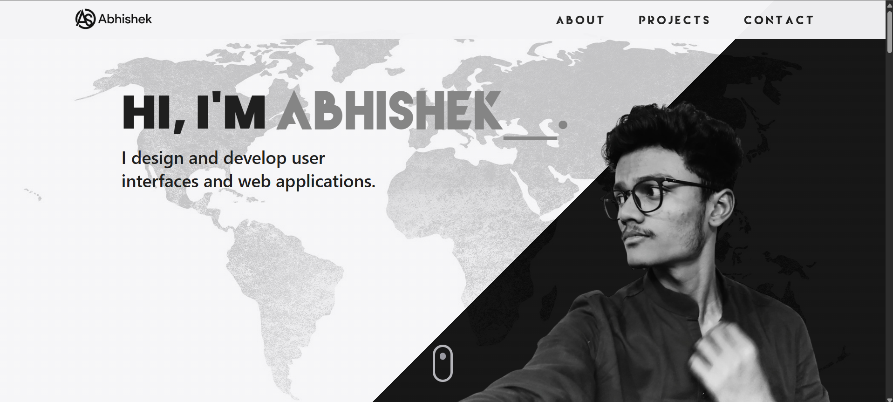

# Abhishek's Portfolio

# [🚀 Visit here:  https://abhisheksangule.netlify.app/ ](https://abhisheksangule.netlify.app/)

---

Welcome to my personal portfolio! This site showcases my projects, skills, and experience as a web developer and engineer.

## Built With

- React.js  
- Framer Motion  
- Tailwind CSS  
- React Router  

## Getting Started

### Prerequisites

Make sure you have [Node.js](https://nodejs.org/) installed.

## Authors

👤 **Abhishek Sangule**

- GitHub: [@AbhishekRDJ](https://github.com/AbhishekRDJ)
- Leetcode: [@AbhishekRDJ](https://leetcode.com/u/Abhishekidz207/)
- LinkedIn: [Abhishek Sangule](https://www.linkedin.com/in/abhishek-sangule-07b202319/)

## Feedback and Contributions

If you have any feedback, suggestions, or would like to contribute to this project, your involvement is highly valued. Feel free to open an [issue](../../issues/) or submit a pull request with your ideas and enhancements. Remember, this template is a starting point, and the true magic lies in making it your own. Enjoy the journey of creating a stunning portfolio that represents your unique talents and accomplishments!

Happy coding and showcasing!

## Show your support

Give a ⭐️ if you like this project!
